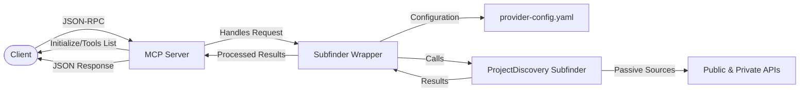

# MCP Subfinder Server

[](LICENSE)
[](https://golang.org/)
[](https://github.com/copyleftdev/mcp-subfinder-server)
[](https://github.com/projectdiscovery/subfinder)

A Model Context Protocol (MCP) server that wraps [ProjectDiscovery's subfinder](https://github.com/projectdiscovery/subfinder) tool for powerful subdomain enumeration through a JSON-RPC API.

## Architecture



## Credit

All the heavy lifting for subdomain enumeration is done by [ProjectDiscovery's subfinder](https://github.com/projectdiscovery/subfinder). This project is simply a MCP server wrapper around their excellent tool.

## Overview

MCP Subfinder Server provides:

- JSON-RPC API to enumerate subdomains for a given domain
- Support for recursive subdomain discovery
- Source filtering capabilities
- Configurable timeouts and threading
- Detailed logging for troubleshooting

## Installation

```bash
# Clone the repository
git clone https://github.com/copyleftdev/mcp-subfinder-server.git
cd mcp-subfinder-server

# Build the server using the Makefile
make build
```

## Usage

The server can be run using the Makefile, which provides several helpful commands:

```bash
# Run the server on the default port (8080)
make run

# Run the server on a custom port
PORT=9090 make run

# Specify a different provider config file
PROVIDER_CONFIG=my-custom-config.yaml make run
```

### Available Makefile Commands

```bash
# Show all available commands
make help

# Run tests
make test

# Run integration tests
make integration-test

# Run live subfinder tests
make live-test

# Generate test coverage report
make coverage

# Format the code
make fmt

# Build for Linux
make build-linux

# Clean the project
make clean
```

## Configuration

For optimal results, add your API keys to the `provider-config.yaml` file. This allows subfinder to use premium sources for better subdomain discovery.

The provider-config.yaml file is checked automatically when running the server with `make run`.

## API Usage

The server exposes a JSON-RPC API at `http://localhost:8080/mcp`.

### Basic Usage Examples with curl

#### 1. Initialize Connection

```bash
curl -X POST http://localhost:8080/mcp \
  -H "Content-Type: application/json" \
  -d '{
    "jsonrpc": "2.0",
    "id": 1,
    "method": "initialize",
    "params": {
      "protocolVersion": "0.3"
    }
  }'
```

#### 2. List Available Tools

```bash
curl -X POST http://localhost:8080/mcp \
  -H "Content-Type: application/json" \
  -d '{
    "jsonrpc": "2.0",
    "id": 2,
    "method": "tools.list"
  }'
```

#### 3. Basic Subdomain Enumeration

```bash
curl -X POST http://localhost:8080/mcp \
  -H "Content-Type: application/json" \
  -d '{
    "jsonrpc": "2.0",
    "id": 3,
    "method": "tools.call",
    "params": {
      "name": "enumerateSubdomains",
      "arguments": {
        "domain": "example.com"
      }
    }
  }'
```

#### 4. Advanced Subdomain Enumeration

```bash
curl -X POST http://localhost:8080/mcp \
  -H "Content-Type: application/json" \
  -d '{
    "jsonrpc": "2.0",
    "id": 4,
    "method": "tools.call",
    "params": {
      "name": "enumerateSubdomains",
      "arguments": {
        "domain": "example.com",
        "timeout": 120,
        "recursive": true,
        "maxDepth": 2,
        "sourcesFilter": "github,dnsdumpster,alienvault"
      }
    }
  }'
```

#### 5. Enumeration with Source Exclusion

```bash
curl -X POST http://localhost:8080/mcp \
  -H "Content-Type: application/json" \
  -d '{
    "jsonrpc": "2.0",
    "id": 5,
    "method": "tools.call",
    "params": {
      "name": "enumerateSubdomains",
      "arguments": {
        "domain": "example.com",
        "timeout": 60,
        "excludeSourcesFilter": "waybackarchive,threatcrowd"
      }
    }
  }'
```

#### 6. Health Check

```bash
curl -X GET http://localhost:8080/health
```

## Available Options

When calling the `enumerateSubdomains` tool, the following options are available:

| Option | Type | Description | Default |
|--------|------|-------------|---------|
| domain | string | The domain to enumerate subdomains for (required) | - |
| timeout | int | Timeout in seconds for the enumeration process | 120 |
| recursive | bool | Whether to recursively check discovered subdomains | false |
| maxDepth | int | Maximum depth for recursive enumeration | 2 |
| sourcesFilter | string | Comma-separated list of sources to use | - |
| excludeSourcesFilter | string | Comma-separated list of sources to exclude | - |

## Docker Support

The project includes Docker support through the Makefile:

```bash
# Build a Docker image
make docker

# Run the server in Docker
make docker-run

# Run with custom port
PORT=9090 make docker-run
```

## Testing

Run tests using the Makefile:

```bash
# Run all tests
make test

# Run with test coverage
make coverage
```

A Postman collection is included in the `docs` folder for easy testing of all API endpoints.

## License

This project is licensed under the MIT License - see the LICENSE file for details.

## Author

[copyleftdev](https://github.com/copyleftdev)
